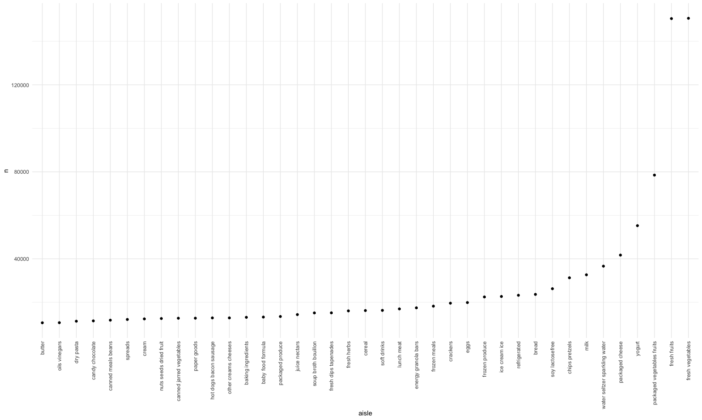
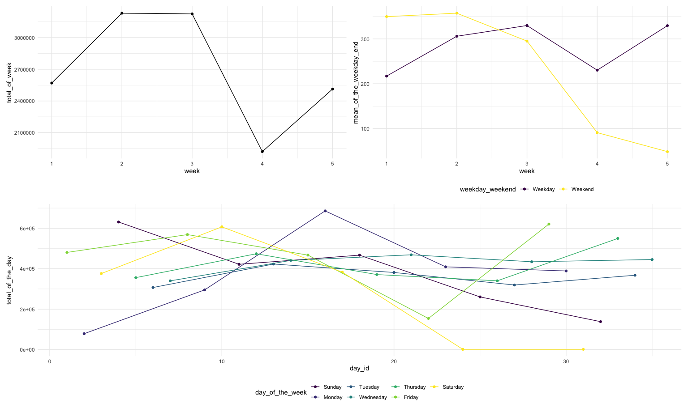
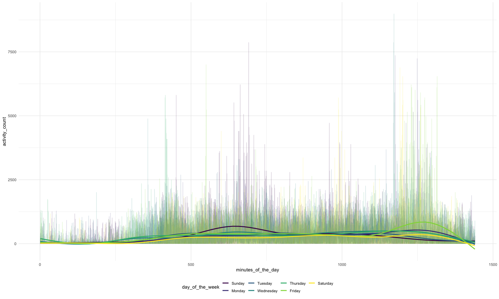
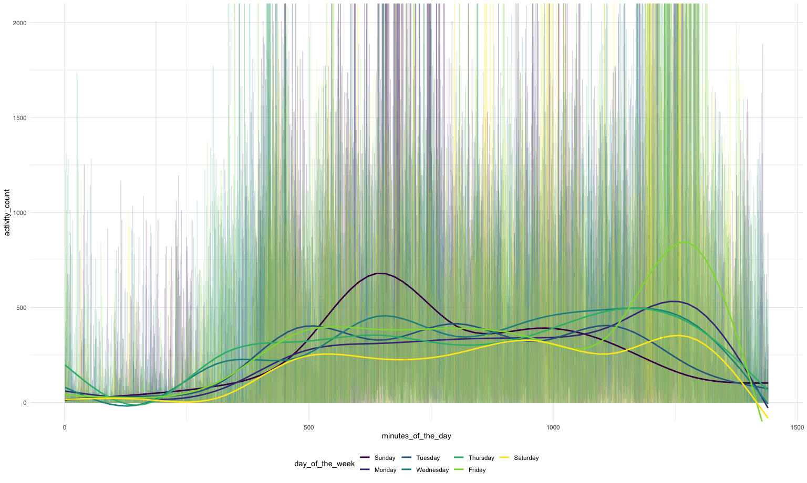
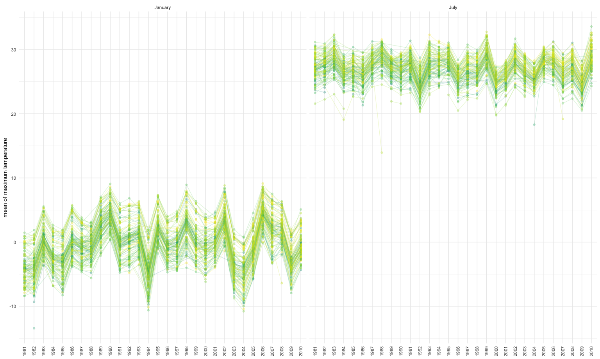
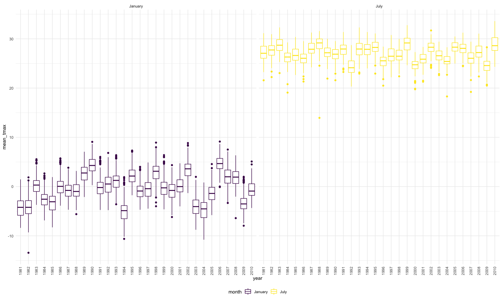
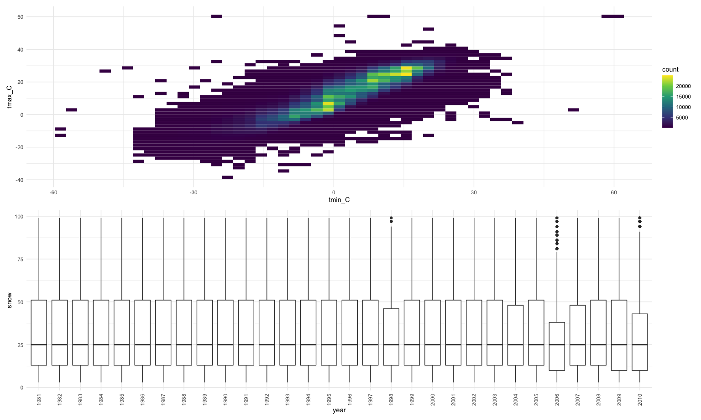

p8105\_hw3\_zl2978
================
Zhiye Lou

\#\#Problem 1  
I will first load the data.

``` r
library(p8105.datasets)
data("instacart")
```

This dataset instacart contains rows and columns. There are user / order
variables – user ID, order ID, order day, and order hour. There are also
item variables – name, aisle, department, and some numeric codes. Then I
will do some exploration of this dataset.

``` r
aisleinfo_df =
  instacart %>% 
    count(aisle) %>% 
    arrange(desc(n))
```

There are 134 aisles, and the most items ordered from is fresh
vegetables.

Then I will make a plot

``` r
instacart %>% 
    count(aisle) %>% 
    filter(n > 10000) %>% 
    mutate(
        aisle = factor(aisle),
        aisle = fct_reorder(aisle, n)
    ) %>% 
    ggplot(aes(x = aisle, y = n)) + 
    geom_point() + 
    theme(axis.text.x = element_text(angle = 90, vjust = 0.5, hjust = 1))
```


Then I will make a table

``` r
instacart %>% 
    filter(aisle %in% c("baking ingredients", "dog food care", "packaged vegetables fruits")) %>% 
    group_by(aisle) %>% 
    count(product_name) %>% 
    mutate(rank = min_rank(desc(n))) %>% 
    filter(rank < 4) %>% 
    arrange(aisle, rank) %>% 
    knitr::kable()
```

| aisle                      | product\_name                                 |    n | rank |
| :------------------------- | :-------------------------------------------- | ---: | ---: |
| baking ingredients         | Light Brown Sugar                             |  499 |    1 |
| baking ingredients         | Pure Baking Soda                              |  387 |    2 |
| baking ingredients         | Cane Sugar                                    |  336 |    3 |
| dog food care              | Snack Sticks Chicken & Rice Recipe Dog Treats |   30 |    1 |
| dog food care              | Organix Chicken & Brown Rice Recipe           |   28 |    2 |
| dog food care              | Small Dog Biscuits                            |   26 |    3 |
| packaged vegetables fruits | Organic Baby Spinach                          | 9784 |    1 |
| packaged vegetables fruits | Organic Raspberries                           | 5546 |    2 |
| packaged vegetables fruits | Organic Blueberries                           | 4966 |    3 |

Then I will make a table showing the mean hour of “Apples” vs “Ice
cream”

``` r
instacart %>% 
    filter(product_name %in% c("Pink Lady Apples", "Coffee Ice Cream")) %>% 
    group_by(product_name, order_dow) %>% 
    summarize(mean_hour = mean(order_hour_of_day)) %>% 
    pivot_wider(
        names_from = order_dow,
        values_from = mean_hour
    ) %>% 
  rename( 
      "Sunday" = "0",
      "Monday" = "1",
      "Tuesday" = "2",
      "Wednesday" = "3",
      "Thursday" = "4",
      "Friday" = "5",
      "Saturday" = "6") %>% 
  knitr::kable()
```

    ## `summarise()` regrouping output by 'product_name' (override with `.groups` argument)

| product\_name    |   Sunday |   Monday |  Tuesday | Wednesday | Thursday |   Friday | Saturday |
| :--------------- | -------: | -------: | -------: | --------: | -------: | -------: | -------: |
| Coffee Ice Cream | 13.77419 | 14.31579 | 15.38095 |  15.31818 | 15.21739 | 12.26316 | 13.83333 |
| Pink Lady Apples | 13.44118 | 11.36000 | 11.70213 |  14.25000 | 11.55172 | 12.78431 | 11.93750 |

\#\#Problem 2  
\#\#\#question 1  
I will first load and tidy the data.

``` r
week_nam = tibble(
  n = 0:6,
  day = c("Sunday","Monday","Tuesday","Wednesday","Thursday","Friday","Saturday"))
accel_df = 
  read_csv("./data/accel_data.csv") %>% 
  janitor::clean_names() %>%
  left_join(week_nam, by = "day") %>% 
  pivot_longer(
    activity_1:activity_1440,
    names_to = "minutes_of_the_day",
    values_to = "activity_count") %>% 
  mutate(
    minutes_of_the_day = substr(minutes_of_the_day,10,13),
    weekday_weekend = if_else(day %in% c("Saturday","Sunday"),"Weekend","Weekday"),
    minutes_of_the_day = as.numeric(minutes_of_the_day),
    day = factor(day),
    day = fct_reorder(day,n))%>% 
  rename("day_of_the_week" = "day") %>% 
  group_by(week) %>% 
  arrange(day_of_the_week, desc(n), .by_group = TRUE) %>% 
  select(-n) %>% 
  relocate(week,day_id,day_of_the_week,weekday_weekend)
```

    ## Parsed with column specification:
    ## cols(
    ##   .default = col_double(),
    ##   day = col_character()
    ## )

    ## See spec(...) for full column specifications.

There are 50400 observations in total, and there are 50400 rows and 6
columns. There are information about the time of recorded variables –
week, day\_id, day\_of\_the\_week,weekday\_weekend,
minutes\_of\_the\_day. The other important variable is the
activity\_count which is the activity counts.

\#\#\#question 2  
I will create a table and a plot showing the total activity for each
day.

``` r
acc_total_df =
   accel_df %>% 
   group_by(week,day_of_the_week,day_id) %>% 
   summarise(total_of_the_day = sum(activity_count))
```

    ## `summarise()` regrouping output by 'week', 'day_of_the_week' (override with `.groups` argument)

``` r
day_of_week_p = 
  ggplot(data = acc_total_df,aes(x = day_id,y = total_of_the_day, color = day_of_the_week)) + 
  geom_point() + 
  geom_line()
acc_total_df %>% 
  select(-day_id) %>% 
  pivot_wider(names_from = week,
              names_prefix = "week ",
              values_from = total_of_the_day) %>%
  knitr::kable()
```

| day\_of\_the\_week |    week 1 | week 2 | week 3 | week 4 | week 5 |
| :----------------- | --------: | -----: | -----: | -----: | -----: |
| Sunday             | 631105.00 | 422018 | 467052 | 260617 | 138421 |
| Monday             |  78828.07 | 295431 | 685910 | 409450 | 389080 |
| Tuesday            | 307094.24 | 423245 | 381507 | 319568 | 367824 |
| Wednesday          | 340115.01 | 440962 | 468869 | 434460 | 445366 |
| Thursday           | 355923.64 | 474048 | 371230 | 340291 | 549658 |
| Friday             | 480542.62 | 568839 | 467420 | 154049 | 620860 |
| Saturday           | 376254.00 | 607175 | 382928 |   1440 |   1440 |

I will create a plot showing the mean activity for weekdays and
weekends.

``` r
weekday_vs_weekend_p = 
  accel_df %>% 
  group_by(week,weekday_weekend) %>% 
  summarise(mean_of_the_weekday_end = mean(activity_count)) %>% 
  ggplot(aes(x = week,y = mean_of_the_weekday_end, color = weekday_weekend)) + 
  geom_point() + 
  geom_line()
```

    ## `summarise()` regrouping output by 'week' (override with `.groups` argument)

I will create a plot showing the trend of different weeks.

``` r
week_trend_p = 
  accel_df %>% 
  group_by(week) %>% 
  summarise(total_of_week = sum(activity_count)) %>% 
ggplot(aes(x = week,y = total_of_week)) + 
geom_point() + geom_line()
```

    ## `summarise()` ungrouping output (override with `.groups` argument)

Then I will join three graphs together

``` r
(week_trend_p + weekday_vs_weekend_p)/day_of_week_p
```



First, the difference between weekdays and weekends are apparent. For
the first two weeks, the mean of activity counts for weekends are
greater than that of weekdays. for the rest three weeks, the mean of the
weekends has largely decreased and be smaller than the mean of weekdays.
Second, the activity counts have increased from week 1 to week 2, and
largely decreased from week 3 to week 4, and there is a smaller increase
from week 4 to week 5. Third, the difference between different days of a
week is not apparent, but Tuesday, Wednesday,and Thursday have
relatively smaller changes in activity counts among different weeks.

\#\#\#question 3 I will make a single-panel plot that shows the 24-hour
activity time courses for each day.

``` r
accel_df %>% 
  ggplot(aes(x = minutes_of_the_day, y = activity_count,color = day_of_the_week)) +   
  geom_line(alpha = 0.2) +
  stat_smooth(se = FALSE)
```

    ## `geom_smooth()` using method = 'gam' and formula 'y ~ s(x, bs = "cs")'


Without further zoom in,the trend in different minutes of each day is
not that obvious, and thus I zoom in with the limit of activity counts
between 0 to 2000.

``` r
accel_df %>% 
  ggplot(aes(x = minutes_of_the_day, y = activity_count,color = day_of_the_week)) +  
  geom_line(alpha = 0.2) + 
  stat_smooth(se = FALSE) + 
  coord_cartesian(ylim = c(0,2000))
```

    ## `geom_smooth()` using method = 'gam' and formula 'y ~ s(x, bs = "cs")'


This plot shows that between 0 to 250 minutes (around 0:00 to 4:10), the
activity counts are pretty low. After 250 minutes, the activity counts
start to increase which implies there are more activities at day time.
Then, around 1250 minutes (around 20:50), the activity counts start to
decrease and this implies there are less activities at evening and night
time. Finally, the activity counts get close to 0 around 1440 minutes
(around 24:00), and this suggests there is almost no activity at
mid-night.

\#\#Problem 3 I will frist load the data.

``` r
library(p8105.datasets)
data("ny_noaa")
```

\#\#\#question 1  
For this data set, there are 2595176 rows and 7 columns. This datasets
has the weather station id – id. There is also a variable date, and
weather variables – prcp (precipitation), snow, snwd (snow depth),
tmax(maximum temperature), and tmin(minimum temperature). There are
1222433 rows that do not have missing values, and the reasons for these
missing values are unknown, and thus these missing value could be
problematic.

Then I will do some data cleaning.

``` r
nyweather_df =
  ny_noaa %>% 
  janitor::clean_names() %>% 
  separate(date, into = c("year","month","day"), sep = "-") %>% 
  mutate(
    tmax = as.numeric(tmax)/10,
    tmin = as.numeric(tmin)/10,
    prcp = prcp/10) %>% 
  rename(
    "tmax_C" = "tmax",
    "tmin_C" = "tmin") 
snow_count_df =
  nyweather_df %>% 
  count(snow) %>% 
    arrange(desc(n)) 
```

The most commonly observed values are 0, because for most of the days,
there are no snow, and thus the snowfall is 0 mm. The second frequently
value for snow is NA which suggests a large portion of missing values.
The third and fourth frequently value for snow is 25 and 13
respectively, and this suggests a moderate snow is very frequently when
there is a snow.

\#\#question 2 Then I will make a two-panel plot showing the average max
temperature in January and in July.

``` r
tmax_jj_df = 
nyweather_df %>% 
  filter(month %in% c("01","07")) %>% 
  mutate(month = if_else (month == "01","January","July")) %>% 
  group_by(month,id,year) %>% 
  summarise(mean_tmax = mean(tmax_C)) 
```

    ## `summarise()` regrouping output by 'month', 'id' (override with `.groups` argument)

``` r
ggplot(data = tmax_jj_df, aes(x = year, y = mean_tmax ,color = id, group = id)) + 
geom_point(alpha = 0.3) +
geom_path(alpha = 0.2) + 
facet_grid(.~month) + 
theme(legend.position = "none", axis.title.x = element_blank(), axis.text.x = element_text(angle = 90, vjust = 0.5, hjust = 1)) + 
labs(y = "mean of maximum temperature")
```

    ## Warning: Removed 7058 rows containing missing values (geom_point).

    ## Warning: Removed 6007 row(s) containing missing values (geom_path).


The most obvious trend is the difference between average maximum
temperature between January and July. Almost every year and every
station in July has a higher average maximum temperature than that of
January. Besides,the outliers in July are more obvious, and they tend to
be the outliers that much lower than other values. To be more accurate
about that, I will plot a boxplot.

``` r
ggplot(data = tmax_jj_df, aes(x = year, y = mean_tmax ,color = month)) +
geom_boxplot() +
facet_grid(.~month) + 
theme(axis.text.x = element_text(angle = 90, vjust = 0.5, hjust = 1))
```

    ## Warning: Removed 7058 rows containing non-finite values (stat_boxplot).



``` r
labs(y = "mean of maximum temperature")
```

    ## $y
    ## [1] "mean of maximum temperature"
    ## 
    ## attr(,"class")
    ## [1] "labels"

As the boxplot shown, the outliers for January are closer to the range
of their regular values compare to those of July, and for January, the
outliers are tend to be higher than the range of regular values.

\#\#question 3 I will first make a plot for tmax vs tmin for the full
dataset.

``` r
min_max_p = 
nyweather_df %>% 
ggplot(aes(x = tmin_C, y = tmax_C)) +
stat_bin2d(bins = 50) +
theme(legend.position = "right")
```

Then I will plot the distribution of snowfall values greater than 0 and
less than 100 separately by year.

``` r
snow_regular_p =
nyweather_df %>% 
  filter(snow > 0) %>% 
  filter(snow < 100) %>% 
ggplot(aes(x = year, y = snow)) +
geom_boxplot() +
theme(axis.text.x = element_text(angle = 90, vjust = 0.5, hjust = 1))
min_max_p/snow_regular_p + 
ggsave("P_3_2.pdf",width = 10, height = 15)
```

    ## Warning: Removed 1136276 rows containing non-finite values (stat_bin2d).
    
    ## Warning: Removed 1136276 rows containing non-finite values (stat_bin2d).


The bin2d plots of maximum temperature vs mimimum temperature shown the
maximum and minimum temperatures are concentrated at (0,7) and (17,25),
and the gradient of this plot is close to 1, and this suggest that an
increasing in minimum temperature usually comes with an increasing in
maximum temperature. The distribution of snow fall graph shown the
variability of regular snow fall (between 0 and 100) is pretty small,
and only 1998,2006, and 2010 has relatively smaller snow fall than other
years’, and have several outliers. For other years, there are nearly no
outliers, and the medium, 25 quantile, 75 quantile are nearly the same.
Besides, except 2006, all the other years’ snow fall data are right
skewed.
